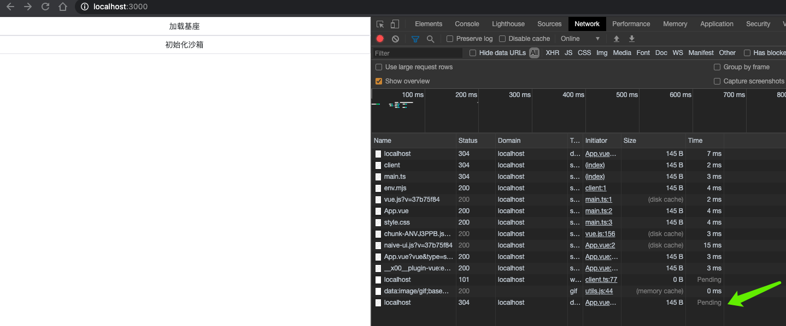

# 微前端 bug demo

## 问题描述

在使用微前端框架时，如果将基座应用使用 iframe 嵌入到其他项目中时，iframe 沙箱初始化会被阻塞，导致子应用无法正常运行。

目前测试发现，出现这个问题为 Chrome 浏览器，在 Chrome 86 - Chrome 92 均会出现，在 Chrome 102 版本未出现。不排除 < Chrome 86 或 > 92 的版本也会出现的可能性。

## 问题复现

1. 克隆本项目到本地
2. 执行 `pnpm install` 安装依赖，当前项目使用的环境如下：
   - node: v16.20.2
   - pnpm: v8.11.0
3. 执行 `pnpm run start` 启动项目

运行成功后，访问 <http://localhost:3000/>，F12 打开控制台，查看网络请求，注意观察沙箱初始化时，iframe 的请求是否被阻塞。

1. 点击 `加载基座` 按钮，将使用 iframe 内嵌基座应用
2. 点击 `初始化沙箱`，此时将会看到沙箱初始化请求被阻塞

## 问题截图

